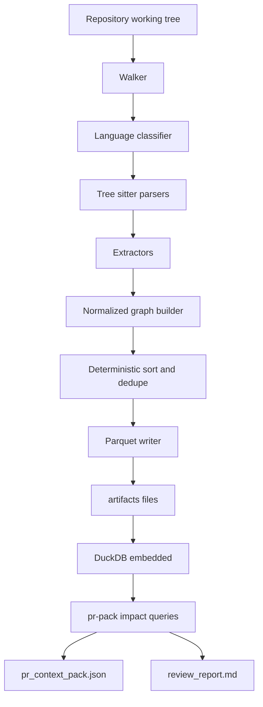

# RepoFalcon Architecture (Go)

This document specifies the RepoFalcon on-disk artifact model, deterministic identifiers, and a Go repository layout for implementing the CLI [`falcon`](docs/ARCHITECTURE.md:1).

## Goals and Constraints

* Deterministic, reproducible outputs for a given repository state and tool version.
* No external database or network service.
* Parse supported languages using tree-sitter (Go bindings).
* Persist analysis results as Parquet (Apache Arrow Go) and query with embedded DuckDB.
* Standard artifact directory layout:

```text
artifacts/
  metadata.json
  files.parquet
  symbols.parquet
  packages.parquet
  edges.parquet
  findings.parquet
  nodes.parquet
  pr_context_pack.json
  review_report.md
```

## CLI Commands and Data Flow

### Commands

* `falcon index`
  * Parses the repo, extracts nodes/edges, and writes canonical Parquet artifacts under `artifacts/`.
* `falcon snapshot`
  * Re-runs extraction and writes artifacts under `artifacts/`.
  * Semantically: “materialize a deterministic snapshot” (even if implemented by reusing the same pipeline as `index`).
* `falcon pr-pack --base <ref> --head <ref>`
  * Computes changed paths (`git diff --name-status`) between base/head.
  * Loads Parquet artifacts (from `index`/`snapshot`) into DuckDB.
  * Computes impact set via SQL over `edges.parquet`.
  * Writes `artifacts/pr_context_pack.json` and `artifacts/review_report.md`.

### Pipeline Overview



## Proposed Go Repository Layout

Single Go module at repo root.

```text
.
  cmd/
    falcon/
      main.go
  internal/
    app/
      index/
      snapshot/
      prpack/
    artifact/
      paths/
      metadata/
      parquet/
    graph/
      model/
      normalize/
      idgen/
      validate/
    extract/
      walker/
      lang/
      treesitter/
      tsjs/
      python/
      java/
      golang/
    impact/
      duckdb/
      queries/
    vcs/
      git/
    config/
    logging/
  pkg/
    falconapi/
  testdata/
    repos/
    golden/
  docs/
    ARCHITECTURE.md
```

### Package boundaries

* `cmd/falcon`: CLI wiring, flags, exit codes.
* `internal/app/*`: orchestration for each command; no business logic leakage into CLI.
* `internal/extract/*`: file walking, language detection, tree-sitter parsing, language-specific extraction.
* `internal/graph/*`: canonical graph types, normalization rules, deterministic ID generation, graph validation.
* `internal/artifact/*`: artifact path conventions, Parquet schemas, metadata handling.
* `internal/impact/*`: DuckDB integration and SQL query strings.
* `internal/vcs/git`: computing repo-relative paths and base/head diffs.
* `pkg/falconapi`: (optional) stable library surface for embedding RepoFalcon in other tools.

## Data Model

### Node types

RepoFalcon persists a property graph with these node types:

* `File`
* `Symbol`
* `Package`
* `Finding`

### Edge types

* `CONTAINS` (Package -> File)
* `DEFINES` (File -> Symbol)
* `IN_FILE` (Symbol -> File) redundant inverse for query convenience
* `IMPORTS` (File -> Package) language-level imports
* `DEPENDS_ON` (Package -> Package) resolved dependency edges
* `REFERENCES` (Symbol -> Symbol) general reference edges
* `CALLS` (Symbol -> Symbol) call edges
* `ABOUT` (Finding -> File|Symbol|Package) what a finding refers to

Notes:
* `IN_FILE` is optional logically, but is included for faster queries and simpler joins.
* Edges MAY carry location information (`site_*`) describing the reference/call site.

## Deterministic Normalization and ID Generation

### Canonical string rules

All IDs are derived by hashing canonical strings. Canonicalization rules:

1. All file paths are **repo-relative**, cleaned, and slash-normalized:
   * apply path clean
   * convert separators to `/`
   * remove any leading `./`
   * forbid `..` segments after cleaning
2. Language tags are lower-case: `ts`, `js`, `py`, `java`, `go`.
3. All hash inputs are UTF-8.
4. Newline normalization is **not** applied to ID inputs (IDs use structural keys), but file content hashing uses raw bytes.

### Hash function and encoding

* Hash: SHA-256
* Encoding: lowercase hex
* ID format: `sha256:<64-hex>`

### ID functions

Define helper:

* `ID(prefix, fields...) = "sha256:" + hex(sha256(prefix + "\n" + join(fields, "\n")))`

Using `\n` as a delimiter avoids ambiguity.

#### File node ID

* Key fields:
  * `path`

`file_id = ID("file:v1", path)`

Rationale: path-based file identity makes PR diffing and longitudinal comparisons straightforward.

#### Package node ID

Packages model both internal and external packages.

Canonical fields:
* `ecosystem` one of `npm`, `pypi`, `maven`, `gomod`, `internal`
* `name` normalized package name / module path / coordinate
* `version` normalized version string or empty
* `scope` optional namespace, else empty

`package_id = ID("package:v1", ecosystem, scope, name, version)`

Internal packages should be represented as `ecosystem=internal`, `name=<repo_rel_dir>`, `version=""`.

#### Symbol node ID

Symbols must be uniquely identified within a snapshot without depending on non-deterministic data.

Canonical fields:
* `language`
* `file_path` (repo-relative)
* `kind` (e.g., `function`, `method`, `class`, `interface`, `variable`, `const`, `type`, `module`)
* `qualified_name` best-effort fully-qualified name
* `start_line`, `start_col`, `end_line`, `end_col` 1-based

`symbol_id = ID("symbol:v1", language, file_path, kind, qualified_name, sl, sc, el, ec)`

Additionally persist:
* `semantic_key = ID("symbol-sem:v1", language, kind, qualified_name)`

`semantic_key` supports best-effort matching across edits and is not required to be unique.

#### Finding node ID

Findings may come from SARIF or other local analyzers.

Canonical fields:
* `source_tool`
* `rule_id`
* `severity`
* `file_path`
* `start_line`, `start_col`, `end_line`, `end_col`
* `message_fingerprint` (sha256 of a normalized message string)

`finding_id = ID("finding:v1", source_tool, rule_id, severity, file_path, sl, sc, el, ec, message_fingerprint)`

#### Edge ID

Edges are content-addressed from their endpoints and, if present, their site location.

Canonical fields:
* `edge_type`
* `src_id`
* `dst_id`
* `site_file_path` or empty
* `site_start_line`, `site_start_col`, `site_end_line`, `site_end_col` or zero

`edge_id = ID("edge:v1", edge_type, src_id, dst_id, site_file_path, sl, sc, el, ec)`

This makes multiple references between the same symbols distinguishable.

## Parquet Artifacts

General conventions:
* All string columns are UTF-8.
* Use 1-based line/column numbers.
* Use `NULL` for unknown optional fields.
* Prefer `LIST<VARCHAR>` for repeated strings.
* Persist JSON blobs only for extensibility (`properties_json`) and keep them optional.

### `nodes.parquet`

Purpose: a common node table for cross-type queries. Every specialized node table row MUST have a corresponding `nodes.parquet` row.

Columns:

| column | type | description |
|---|---|---|
| `node_id` | VARCHAR | equals `file_id` or `symbol_id` or `package_id` or `finding_id` |
| `node_type` | VARCHAR | one of `File`, `Symbol`, `Package`, `Finding` |
| `display_name` | VARCHAR | human-friendly name (path, qualified name, package coordinate, rule id) |
| `primary_file_id` | VARCHAR NULL | for `Symbol` and `Finding` where a file exists |
| `primary_package_id` | VARCHAR NULL | for `Symbol` and `File` where a package exists |
| `language` | VARCHAR NULL | for `File` and `Symbol` |
| `key` | VARCHAR | canonical key string used to produce `node_id` (debugging) |

### `files.parquet`

Columns:

| column | type | description |
|---|---|---|
| `file_id` | VARCHAR | deterministic file node id |
| `path` | VARCHAR | repo-relative path |
| `language` | VARCHAR | `ts`, `js`, `py`, `java`, `go`, or `unknown` |
| `extension` | VARCHAR | file extension without dot |
| `size_bytes` | BIGINT | byte size |
| `content_sha256` | VARCHAR | lowercase hex sha256 of raw file bytes |
| `lines` | INTEGER NULL | number of lines (LF count + 1), optional |
| `is_generated` | BOOLEAN | best-effort heuristic |
| `is_test` | BOOLEAN | best-effort heuristic |

### `packages.parquet`

Columns:

| column | type | description |
|---|---|---|
| `package_id` | VARCHAR | deterministic package node id |
| `ecosystem` | VARCHAR | `npm`, `pypi`, `maven`, `gomod`, `internal` |
| `scope` | VARCHAR | namespace or group id; empty if none |
| `name` | VARCHAR | package name / module path / artifact id / internal dir |
| `version` | VARCHAR | version if known else empty |
| `is_internal` | BOOLEAN | true for repo-owned packages |
| `root_path` | VARCHAR NULL | repo-relative directory for internal packages |
| `manifest_path` | VARCHAR NULL | repo-relative path to manifest (e.g., `package.json`, `pyproject.toml`, `pom.xml`, `go.mod`) |

### `symbols.parquet`

Columns:

| column | type | description |
|---|---|---|
| `symbol_id` | VARCHAR | deterministic symbol node id |
| `file_id` | VARCHAR | containing file |
| `package_id` | VARCHAR NULL | containing package if available |
| `language` | VARCHAR | `ts`, `js`, `py`, `java`, `go` |
| `kind` | VARCHAR | symbol kind |
| `name` | VARCHAR | simple name |
| `qualified_name` | VARCHAR | best-effort fully-qualified name |
| `signature` | VARCHAR NULL | best-effort signature string |
| `semantic_key` | VARCHAR | stable-ish semantic hash for matching |
| `start_line` | INTEGER | 1-based |
| `start_col` | INTEGER | 1-based |
| `end_line` | INTEGER | 1-based |
| `end_col` | INTEGER | 1-based |
| `visibility` | VARCHAR NULL | e.g., `public`, `private`, `protected`, `package` |
| `modifiers` | LIST<VARCHAR> NULL | e.g., `static`, `async` |
| `container_symbol_id` | VARCHAR NULL | enclosing symbol (class, module, etc.) |

### `findings.parquet`

Columns:

| column | type | description |
|---|---|---|
| `finding_id` | VARCHAR | deterministic finding node id |
| `source_tool` | VARCHAR | e.g., `semgrep`, `gosec`, `eslint` |
| `rule_id` | VARCHAR | analyzer rule identifier |
| `severity` | VARCHAR | `info`, `low`, `medium`, `high`, `critical` |
| `message` | VARCHAR | human-readable finding message |
| `message_fingerprint` | VARCHAR | sha256 of normalized message |
| `file_id` | VARCHAR NULL | file location when present |
| `symbol_id` | VARCHAR NULL | symbol when mapped |
| `package_id` | VARCHAR NULL | package when mapped |
| `start_line` | INTEGER NULL | 1-based |
| `start_col` | INTEGER NULL | 1-based |
| `end_line` | INTEGER NULL | 1-based |
| `end_col` | INTEGER NULL | 1-based |
| `cwe` | LIST<INTEGER> NULL | CWE ids if present |
| `tags` | LIST<VARCHAR> NULL | analyzer-provided tags |
| `properties_json` | VARCHAR NULL | optional JSON for extra data |

### `edges.parquet`

Columns:

| column | type | description |
|---|---|---|
| `edge_id` | VARCHAR | deterministic edge id |
| `edge_type` | VARCHAR | one of the supported edge types |
| `src_id` | VARCHAR | source node id |
| `dst_id` | VARCHAR | destination node id |
| `src_type` | VARCHAR | node type of `src_id` |
| `dst_type` | VARCHAR | node type of `dst_id` |
| `site_file_id` | VARCHAR NULL | file containing the reference site |
| `site_start_line` | INTEGER NULL | 1-based |
| `site_start_col` | INTEGER NULL | 1-based |
| `site_end_line` | INTEGER NULL | 1-based |
| `site_end_col` | INTEGER NULL | 1-based |
| `confidence` | FLOAT NULL | optional confidence score |
| `properties_json` | VARCHAR NULL | optional JSON payload |

## `metadata.json`

To preserve determinism, `metadata.json` should avoid wall-clock timestamps by default.

Minimal schema:

```json
{
  "schema_version": "1",
  "tool": {
    "name": "repofalcon",
    "version": "0.0.0",
    "commit": "",
    "dirty": false
  },
  "repo": {
    "root": ".",
    "vcs": "git",
    "head": "<git sha>",
    "worktree_clean": true
  },
  "artifacts": {
    "path": "artifacts",
    "tables": [
      "nodes.parquet",
      "files.parquet",
      "packages.parquet",
      "symbols.parquet",
      "edges.parquet",
      "findings.parquet"
    ]
  },
  "determinism": {
    "id_hash": "sha256",
    "id_encoding": "hex",
    "path_root": "repo-relative",
    "timestamps": "omitted"
  }
}
```

Rules:
* `tool.commit` is the RepoFalcon build commit (optional but recommended for provenance).
* `repo.head` is the analyzed git commit.
* Do not include `created_at` unless behind a non-default flag.

## Determinism Rules

To make outputs reproducible:

1. **Stable ordering**: before writing Parquet, sort rows by primary key columns:
   * `files` by `path`
   * `packages` by `ecosystem, scope, name, version`
   * `symbols` by `file_id, start_line, start_col, kind, qualified_name`
   * `edges` by `edge_type, src_id, dst_id, site_file_id, site_start_line, site_start_col`
   * `findings` by `source_tool, rule_id, file_id, start_line, start_col, message_fingerprint`
2. **Deduping**: ensure uniqueness by `*_id` and drop duplicates deterministically.
3. **Fixed writer settings**: keep Parquet writer settings constant across runs (compression, row group size).
4. **No non-deterministic inputs**: do not include absolute paths, hostnames, random UUIDs, or timestamps in IDs.

Byte-for-byte identical Parquet files may still vary with different Arrow/Parquet library versions. RepoFalcon should treat determinism primarily as stable logical content.

## PR Pack Impact Computation (DuckDB)

### Inputs

* `base_ref`, `head_ref`
* Changed paths from git diff
* Existing Parquet tables under `artifacts/`

### Seed set

1. Changed files by path.
2. Symbols defined in changed files (`DEFINES`).
3. Optionally include packages containing changed files (`CONTAINS`).

### Core idea

Compute the transitive closure of:
* `CALLS` and `REFERENCES` between symbols (both directions, with a depth cap).
* Roll up to files and packages.
* Include findings attached via `ABOUT`.

### Example SQL (DuckDB)

Assume changed paths are provided as a temporary table `changed_paths(path VARCHAR)`.

```sql
-- Load Parquet tables
CREATE VIEW files AS SELECT * FROM read_parquet('artifacts/files.parquet');
CREATE VIEW symbols AS SELECT * FROM read_parquet('artifacts/symbols.parquet');
CREATE VIEW edges AS SELECT * FROM read_parquet('artifacts/edges.parquet');
CREATE VIEW findings AS SELECT * FROM read_parquet('artifacts/findings.parquet');
```

Seed nodes (files and the symbols they define):

```sql
CREATE TEMP VIEW changed_files AS
SELECT f.file_id, f.path
FROM files f
JOIN changed_paths c ON c.path = f.path;

CREATE TEMP VIEW seed_symbols AS
SELECT e.dst_id AS symbol_id
FROM edges e
JOIN changed_files cf ON e.src_id = cf.file_id
WHERE e.edge_type = 'DEFINES';
```

Recursive impact closure over `CALLS` and `REFERENCES`:

```sql
WITH RECURSIVE impacted_symbols(symbol_id, depth) AS (
  SELECT symbol_id, 0 FROM seed_symbols
  UNION
  -- upstream dependents
  SELECT e.src_id, i.depth + 1
  FROM edges e
  JOIN impacted_symbols i ON e.dst_id = i.symbol_id
  WHERE e.edge_type IN ('CALLS', 'REFERENCES') AND i.depth < 25
  UNION
  -- downstream dependencies
  SELECT e.dst_id, i.depth + 1
  FROM edges e
  JOIN impacted_symbols i ON e.src_id = i.symbol_id
  WHERE e.edge_type IN ('CALLS', 'REFERENCES') AND i.depth < 25
)
SELECT DISTINCT symbol_id FROM impacted_symbols;
```

Roll up to impacted files and packages:

```sql
CREATE TEMP VIEW impacted_symbol_ids AS
WITH RECURSIVE impacted_symbols(symbol_id, depth) AS (
  SELECT symbol_id, 0 FROM seed_symbols
  UNION
  SELECT e.src_id, depth + 1
  FROM edges e JOIN impacted_symbols i ON e.dst_id = i.symbol_id
  WHERE e.edge_type IN ('CALLS', 'REFERENCES') AND depth < 25
  UNION
  SELECT e.dst_id, depth + 1
  FROM edges e JOIN impacted_symbols i ON e.src_id = i.symbol_id
  WHERE e.edge_type IN ('CALLS', 'REFERENCES') AND depth < 25
)
SELECT DISTINCT symbol_id FROM impacted_symbols;

CREATE TEMP VIEW impacted_files AS
SELECT DISTINCT s.file_id
FROM symbols s
JOIN impacted_symbol_ids i ON i.symbol_id = s.symbol_id
UNION
SELECT file_id FROM changed_files;

CREATE TEMP VIEW impacted_packages AS
SELECT DISTINCT s.package_id AS package_id
FROM symbols s
JOIN impacted_symbol_ids i ON i.symbol_id = s.symbol_id
WHERE s.package_id IS NOT NULL;
```

Attach findings:

```sql
SELECT f.*
FROM findings f
LEFT JOIN impacted_symbol_ids isy ON f.symbol_id = isy.symbol_id
LEFT JOIN impacted_files ifi ON f.file_id = ifi.file_id
LEFT JOIN impacted_packages ip ON f.package_id = ip.package_id
WHERE isy.symbol_id IS NOT NULL OR ifi.file_id IS NOT NULL OR ip.package_id IS NOT NULL;
```

Outputs:
* `pr_context_pack.json`: impacted files, symbols, packages, findings (and optionally a ranked list by degree).
* `review_report.md`: a human summary with top impacted packages/symbols and notable findings.

## Testing Strategy

### Unit tests

* Normalization:
  * path canonicalization
  * language tag normalization
* ID generation:
  * golden tests for `file_id`, `package_id`, `symbol_id`, `finding_id`, `edge_id`
* Extractors:
  * per-language fixtures that assert extracted symbols and edges
* Parquet schema:
  * validate required columns exist and have expected Arrow types

### Integration tests

Use tiny repositories under `testdata/repos/` with deterministic expected outputs.

Patterns:
* Run `falcon snapshot` on a fixture repo.
* Compare:
  * row counts per table
  * sets of primary keys (`*_id`)
  * DuckDB query outputs (impact closure results)
* Maintain golden expectations under `testdata/golden/`.

### Determinism checks

* Run snapshot twice and compare:
  * `sha256sum` of Parquet files (best-effort)
  * or stable query results over Parquet (robust across Parquet writer changes)

